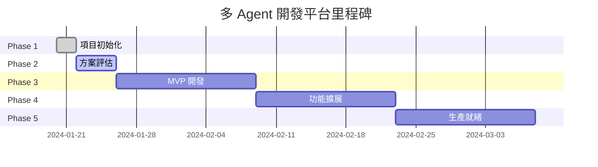

# 多 Agent 協作開發平台 - 開發進度追蹤

## 📋 項目概述

### 項目目標
建立一個智能化的多 Agent 協作開發平台，通過專業化 AI Agent 的分工協作，大幅提升個人開發者的開發效率和代碼品質。

### 核心價值主張
- **效率提升**: 目標實現 3-5 倍開發速度提升
- **品質保證**: 自動化代碼審查和測試
- **知識累積**: 建立可重用的開發模式和最佳實踐
- **成本控制**: 平衡功能需求與個人開發者的資源限制

### 技術願景
```
個人開發者 → 多 Agent 協作系統 → 高效軟件交付
     ↑              ↓                ↑
   需求輸入      智能分工           品質輸出
```

## 🎯 技術棧選擇

### 核心決策
- **主框架**: CrewAI (快速驗證) + 自定義擴展 (深度整合)
- **LLM 後端**: Claude API (主要) + 本地 LLM (備選)
- **通信機制**: Redis Pub/Sub + WebSocket
- **部署策略**: Docker Compose (開發) + Cloud (生產)
- **監控方案**: 自建簡單面板 + Prometheus (後期)

### 選型理由
1. **CrewAI 作為基礎**: 成熟穩定，快速驗證概念可行性
2. **漸進式自定義**: 保持靈活性，根據實際需求擴展
3. **成本可控**: 混合本地和雲端資源，平衡效能與費用
4. **學習價值**: 既能快速見效，又能深度掌握技術

## 📊 階段性進度

### Phase 1: 項目初始化 ✅ (已完成)
**時間範圍**: 2024-01-20 → 2024-01-22

**完成項目**:
- [x] 創建完整目錄結構
- [x] 技術方案初步研究
- [x] CrewAI vs 自建系統對比分析
- [x] 確定混合開發策略
- [x] 建立開發環境基礎

**關鍵成果**:
```
Multi-Agent-Dev/
├── agents/          # Agent 實現目錄
├── orchestration/   # 任務編排系統
├── communication/   # 通信協調機制
├── knowledge-base/  # 共享知識庫
├── monitoring/      # 監控和分析
├── tools/          # 開發工具集
├── examples/       # 示例和模板
└── docs/          # 項目文檔
```

**技術調研結論**:
- CrewAI 適合快速原型驗證
- 自建系統提供更大靈活性
- 混合方案能平衡效率與控制權
- 個人開發者應優先考慮快速見效

### Phase 2: 方案深度評估 🔄 (進行中)
**時間範圍**: 2024-01-22 → 2024-01-26

**當前進度**:
- [x] 完成 CrewAI 技術調研
- [x] 分析個人開發者使用場景
- [x] 評估成本效益比例
- [⏳] 編寫詳細方案對比文檔
- [⏳] 制定技術實施路線圖
- [ ] 準備 MVP 開發計劃

**重要發現**:
1. **CrewAI 優勢明顯**:
   - 開發時間縮短 70%
   - 社區支持豐富
   - 與現有工具整合容易

2. **成本考量**:
   - 月度 API 費用: $50-150 (可接受範圍)
   - 開發時間投資: 2-4 週 vs 2-3 月
   - 學習成本: 低 vs 高

3. **技術風險**:
   - CrewAI 依賴外部 API (中等風險)
   - 自建系統複雜度高 (高風險)
   - 混合方案風險可控 (低風險)

### Phase 3: MVP 原型開發 📋 (待開始)
**預計時間**: 2024-01-26 → 2024-02-09

**計劃任務**:
- [ ] CrewAI 環境設置和配置
- [ ] 創建基礎 Agent 角色 (開發者、審查者)
- [ ] 實現簡單的任務分發機制
- [ ] 與 Claude Code 集成測試
- [ ] 建立基本監控和日誌
- [ ] 性能和效果初步驗證

**預期成果**:
- 可運行的 2-Agent 協作系統
- 與 VS Code Claude Code 的無縫整合
- 基本的任務協調和進度追蹤
- 效果評估數據和用戶體驗反饋

### Phase 4: 功能擴展和優化 🚀 (規劃中)
**預計時間**: 2024-02-09 → 2024-02-23

**規劃功能**:
- [ ] 增加專業化 Agent (前端、後端、測試)
- [ ] 實現更複雜的工作流編排
- [ ] 添加代碼品質檢查和自動化測試
- [ ] 建立知識庫和模板系統
- [ ] 優化性能和用戶體驗

## ⏱️ 里程碑時間線



### 關鍵里程碑

#### M1: 技術方案確定 ✅
- **日期**: 2024-01-22
- **標誌**: 完成 CrewAI vs 自建系統對比，確定混合方案
- **成果**: 技術選型文檔和實施計劃

#### M2: 可行性驗證 (目標)
- **日期**: 2024-01-30
- **標誌**: MVP 原型運行，基本功能驗證
- **成果**: 可演示的多 Agent 協作系統

#### M3: 生產可用 (目標)
- **日期**: 2024-02-15
- **標誌**: 完整功能實現，性能達標
- **成果**: 可用於日常開發工作的穩定系統

#### M4: 社區分享 (目標)
- **日期**: 2024-03-01
- **標誌**: 開源發布，文檔完善
- **成果**: GitHub 開源項目，技術分享文章

## ⚠️ 風險和挑戰

### 技術風險

#### 1. API 依賴風險 (中)
**風險描述**: CrewAI 主要依賴外部 LLM API，存在服務中斷風險
**緩解措施**:
- 配置多個 LLM 提供商作為備選
- 實現本地 LLM 的備用方案
- 建立 API 調用的重試和降級機制

#### 2. 成本控制風險 (中)
**風險描述**: 多 Agent 協作可能導致 API 調用成本快速增長
**緩解措施**:
- 設置月度 API 使用限額和告警
- 實現智能緩存減少重複調用
- 優化 Agent 間通信效率

#### 3. 複雜度管理風險 (高)
**風險描述**: Agent 間協作邏輯複雜，可能導致難以調試的問題
**緩解措施**:
- 從簡單場景開始，漸進增加複雜度
- 建立完善的日誌和監控機制
- 實現詳細的錯誤處理和回滾能力

### 項目風險

#### 1. 時間投入風險 (中)
**風險描述**: 作為個人項目，時間分配可能不穩定
**緩解措施**:
- 設定靈活的里程碑和緩衝時間
- 優先實現核心功能，次要功能後續迭代
- 建立每周最小進度目標

#### 2. 技術學習曲線 (中)
**風險描述**: 多 Agent 架構和 CrewAI 需要學習時間
**緩解措施**:
- 先從官方示例和教程開始
- 參與社區討論和經驗分享
- 保持文檔記錄便於後續參考

## 📈 效果評估指標

### 開發效率指標
- **任務完成時間**: 相比傳統開發方式的時間節省
- **代碼品質**: 自動化檢查通過率和 Bug 發現率
- **工作流程**: 從需求到部署的端到端時間

### 技術指標
- **系統響應時間**: Agent 響應和任務完成時間
- **資源使用**: CPU、記憶體和 API 調用消耗
- **穩定性**: 系統運行時間和錯誤率

### 用戶體驗指標
- **易用性**: 學習成本和操作複雜度
- **可靠性**: 功能可用性和結果一致性
- **擴展性**: 新功能添加的便利性

## 🎯 下一步行動計劃

### 本週重點 (2024-01-22 → 2024-01-26)
1. **完成文檔編寫** (優先級: 高)
   - [⏳] 方案對比分析文檔
   - [ ] 技術決策記錄 (ADR)
   - [ ] 項目路線圖

2. **技術準備** (優先級: 高)
   - [ ] 安裝和配置 CrewAI 開發環境
   - [ ] 學習 CrewAI 官方教程和最佳實踐
   - [ ] 準備第一個 Agent 原型代碼

3. **項目管理** (優先級: 中)
   - [ ] 設置 GitHub 倉庫和項目看板
   - [ ] 建立開發日誌和進度追蹤機制
   - [ ] 準備技術分享和社區討論

### 下週重點 (2024-01-26 → 2024-02-02)
1. **MVP 開發啟動**
   - 建立基礎 2-Agent 系統
   - 實現簡單任務協作流程
   - 與 Claude Code 初步集成

2. **驗證和測試**
   - 測試基本功能和性能
   - 收集用戶體驗反饋
   - 評估技術選型正確性

## 📚 學習和研究記錄

### 已完成研究
1. **CrewAI 框架深度分析**
   - 架構設計理念和核心概念
   - Agent 角色定義和任務分配機制
   - 與 LangChain 的整合方式
   - 社區生態和擴展性

2. **多 Agent 協作模式研究**
   - 角色專業化 vs 通用化
   - 任務分解和依賴管理
   - 通信協議和衝突解決
   - 效果評估和優化策略

3. **個人開發者需求分析**
   - 常見開發痛點和效率瓶頸
   - 成本敏感度和投資回報期望
   - 技術學習能力和時間安排
   - 長期發展規劃和技能提升

### 待深入研究
1. **高級協作模式**
   - 動態角色分配和負載均衡
   - 自適應工作流調整
   - 跨項目知識遷移和復用

2. **性能優化策略**
   - API 調用優化和緩存機制
   - 並行處理和異步任務管理
   - 資源監控和自動擴縮容

## 📊 資源投入統計

### 時間投入 (截至 2024-01-22)
- **研究和調研**: 8 小時
- **技術方案設計**: 6 小時  
- **文檔編寫**: 4 小時
- **環境配置**: 2 小時
- **總計**: 20 小時

### 預計總投入 (完整項目)
- **Phase 2 (方案評估)**: 10 小時
- **Phase 3 (MVP 開發)**: 40 小時
- **Phase 4 (功能擴展)**: 30 小時
- **Phase 5 (完善優化)**: 20 小時
- **總計預估**: 120 小時 (約 3 個月業餘時間)

### 成本投入
- **LLM API 費用**: $50-150/月 (取決於使用量)
- **雲端資源**: $20-50/月 (如需要)
- **工具和軟件**: $0 (開源工具為主)
- **總月度成本**: $70-200

---

## 📝 更新日誌

### 2024-01-22
- 創建開發進度追蹤文檔
- 完成 Phase 1 項目初始化
- 啟動 Phase 2 方案深度評估
- 更新項目里程碑和時間規劃

### 2024-01-20
- 項目啟動
- 完成目錄結構創建
- 開始技術方案研究

---

*本文檔將隨著項目進展持續更新，記錄開發過程中的重要決策、技術發現和經驗總結。*